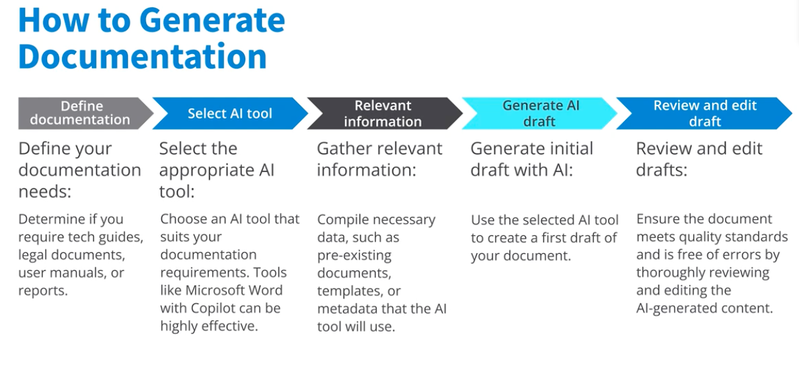

# Section 2: Generative AI Usages for AI in Documentation

## Overview

Creating and maintaining documentation is often tedious, but generative AI tools like Copilot make the process seamless and efficient. AI can automatically generate, update, and manage documentation, ensuring it is comprehensive, up-to-date, and easy to understand. This transformation allows teams to focus on innovation and growth rather than manual documentation tasks.

## Key Concepts

### 1. Automated Documentation Creation

- **AI-Generated Content**: AI tools can create documentation from code, templates, or a few inputs, reducing human error and saving time.
- **Domain Applications**:
  - *Legal*: Draft contracts by pulling relevant clauses from databases.
    - Draft contracts
    - Relevant clauses from a database
    - Consistency and compliance
  - *Medical*: Generate patient summaries by synthesizing data from multiple sources.
    - Generate patient summaries
    - Synthesize data from lab results, medical history, and treatment plans
    - Comprehensive and up-to-date patient information
  - *Software*: Automatically generate API docs by parsing code and usage patterns.
    - Automatically generate API docs
    - Create a detailed guides that explain functionality and usage patterns

### 2. Efficient Document Management

- **Organization**: AI can categorize, update, and manage documents, improving accessibility and operational efficiency.
- **Continuous Updates**: AI tools can monitor and update documents in real-time as new data becomes available, ensuring accuracy and relevance.

### 3. Enhanced Version Control

- **Commit Messages**: AI can analyze code changes and suggest clear, descriptive commit messages, maintaining a high-quality, informative project history.
- **Standardization**: Copilot can enforce standardized formats and include relevant details automatically.

## Actionable Steps for Using AI in Documentation

1. **Define Documentation Needs**: Identify if you need technical guides, legal docs, user manuals, or reports.
2. **Select the Right AI Tool**: Choose a tool (e.g., Copilot, Microsoft Word with Copilot) that fits your requirements.
   - Choose an AI tool that suits the documentation requirements. Tools like Microsoft Word with Copilot can be highly effective.
3. **Gather Relevant Information**: Compile existing documents, templates, and metadata for the AI to use.
   - Compile necessary data, such as pre-existing documents, templates, and or metadata that the AI tool can leverage.
4. **Generate AI Drafts**: Use AI to create initial drafts.
   - Use the selected AI tool to create a first draft of the documentation.
5. **Review and Edit**: Thoroughly review and edit AI-generated content to ensure quality and accuracy.
   - Ensure the documents meet quality standards and are free of errors by thoroughly reviewing and editing the AI-generated content.
6. **Automate Updates**: Set up systems for continuous monitoring and updating of documentation.
7. **Leverage AI for Version Control**: Use AI to generate clear, standardized commit messages for better project history.
   - Analyze code changes
   - Suggest descriptive commit messages
   - Save time and effort
   - Maintain a high standard of clarity and consistency
   - Suggest standardized formats
   - Include relevant details automatically

## Practical Examples - AI Tools in Scenarios

### Example 1: Technical Manuals

Imagine working on complex machinery. AI keeps technical manuals up-to-date in real-time as new data arrives, so you always have the latest instructions—no more outdated documentation.

### Example 2: Financial Reports

AI can pull data from multiple sources to compile accurate, comprehensive financial statements quickly, minimizing errors and ensuring consistency.

### Example 3: Software API Documentation

Suppose you're developing a new API. You can set up a continuous integration pipeline to trigger documentation updates whenever code changes are pushed. A generative AI tool analyzes your code, generates initial documentation, and incorporates code comments and usage examples. You review and approve the AI-generated docs before publishing, ensuring accuracy and completeness.

1. Set up AI system
   - Automatically trigger documentation updates
   - Continuous integration pipeline
2. AI Tool
   - Analyze the code and generate initial documentation
   - Examine the function definitions and parameters, and return types
3. AI works its magic
    - Scan code comments and existing documentation to add context
    - Suggest improvements
    - Set up a review process for approval

## Personal Notes

- **Challenges**: Ensuring the AI-generated documentation meets specific organizational standards may require initial manual review and adjustment.
- **Overcoming Challenges**: Start with AI-generated drafts and iteratively refine them. Use feedback loops to improve AI suggestions over time.
- **Connection to Previous Knowledge**: This section builds on the idea of AI-assisted code review, showing how similar automation can be applied to documentation and project management.

## Conclusion

Generative AI tools like Copilot revolutionize documentation by automating creation, management, and version control. By integrating these tools, you can boost productivity, maintain high standards of clarity and accuracy, and ensure your documentation remains reliable and up-to-date. Start by identifying areas where automation can save time and reduce errors, then select the appropriate AI tool to meet your needs.